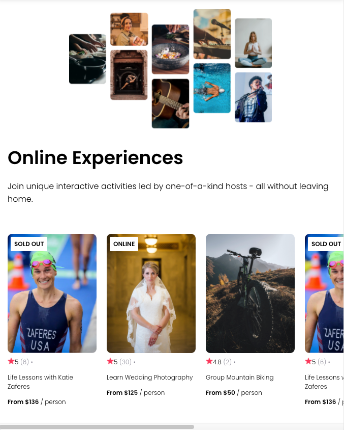

# Project 3

This is a mockup of airbnb Experiences webpage built for a course on React skills with Bob Ziroll. It is a single-page app with a navigation bar, a hero, a bodyan image, and a body with cards. The cards fetch their information from a data.js file through usage of props. Each card fetchs different information and have badges according to their availability status. Practice with components, props, and styling.

## Feature

- Navigation bar with logo
- Hero image with different types of experiences user could have
- Cards with stars rating, number of reviews, location, title and price
- Badges on top of each card showing if experience still has spots available or if it's online.

## Technologies

- HTML
- CSS
- JavaScript
- React

## Start the App

In the project directory, you can run:

### `npm start`

Runs the app in the development mode.\
Open [http://localhost:3000](http://localhost:3000) to view it in your browser.

The page will reload when you make changes.\
You may also see any lint errors in the console.

### `npm test`

Launches the test runner in the interactive watch mode.\
See the section about [running tests](https://facebook.github.io/create-react-app/docs/running-tests) for more information.

### `npm run build`

Builds the app for production to the `build` folder.\
It correctly bundles React in production mode and optimizes the build for the best performance.

The build is minified and the filenames include the hashes.\
Your app is ready to be deployed!

See the section about [deployment](https://facebook.github.io/create-react-app/docs/deployment) for more information.

## Further Help

You can learn more in the [Create React App documentation](https://facebook.github.io/create-react-app/docs/getting-started).

To learn React, check out the [React documentation](https://reactjs.org/).

### Author

[Tanimara Elias Santos](https://github.com/anthropovixen)

### Version

1.0.0
